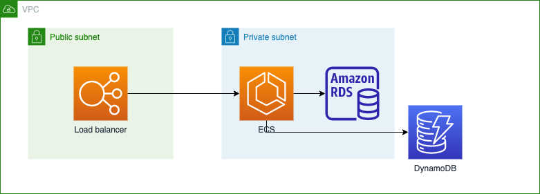

# 2022/01/18 授業内容

---
# 演習(続き)
terraformを使ってアプリケーションサーバを構築する

## システム構成


## 事前準備
### ラボ演習環境の準備
ラボ演習環境「AWS Academy Learner Lab - Associate Services」を用意したので、そちらを利用できるようにする。
AWSから学校のメールアドレス宛に届いたメールの「Get Started」 をクリックしてアカウントの作成を完了してください。

### Key Pairsの作成
1. AWS consoleにログイン
2. EC2 -> Key Pairsに移動
3. 「Create key pair」を押下
4. Nameを入力
5. 「Create key pair」を押下

    __秘密鍵がダウンロードされます。ダウンロードした秘密鍵は厳重に保管しておくこと__

### AWS Consoleで以下のIAMロールを修正

1. AWS consoleにログイン
2. IAM -> Rolesに移動
3. LabRoleを選択
4. 「Attach policies」を押下
5. Filter policiesにDynamodbを入力
6. AmazonDynamodbFullAccessを選択
7. 「Attach policy」を押下

作成したロールを表示して、Role ARNをコピーしておく

IAMロールもterraformで作成できるはずだが、使用している環境ではIAMロールの作成はできないため、手動で作成する。

### terafformの準備（terraformはインストール済みのため不要）
Cloud 9を立ち上げてterraformをインストールする

1. tfenvをインストール
```
git clone https://github.com/tfutils/tfenv.git ~/.tfenv
```

2. tfenvのパスを設定
`sudo ln -s ~/.tfenv/bin/* /usr/local/bin`

3. terraformをインストール
```
tfenv install 0.15.5
```

4. インストールしたバージョンを使用する
```
tfenv use 0.15.5
```

5. バージョンの確認
```
terraform --version
```

## 環境構築手順

1. 以下のプロジェクトをCloud 9上にcloneする。
https://github.com/cupperservice/terraform-sample

2. staging/main.tfを自身の環境に合わせて修正する
```

terraform {
  required_version = "= 0.15.5"
}

module "common" {
  source = "../common"
  region = "ap-northeast-1" -> 自分の環境のリージョンに変更する
  az1 = "ap-northeast-1a"   -> 自分の環境のAZに変更する
  az2 = "ap-northeast-1c"   -> 自分の環境のAZに変更する
  bastion = {
    image_id = "ami-0404778e217f54308"  -> 自分の環境のイメージIDに変更する（Amazon linux2(x86））
    key_name = "cupper"                 -> 自分の環境の鍵の名前に変更する
  }
  database = {
    name = "mall"
    username = "kawashima"    -> 任意の値に変更する
    password = "kazuhisa"     -> 任意の値に変更する
  }
  session = {
    table_name = "cupper-Session"
    key_name = "sessionId"
  }
  ecs = {
    exec_role = "" -> IAMロール()のARNに変更する
    task_role = "" -> IAMロール()のARNに変更する
  }
}
```

3. terraformを実行して環境を構築する

## 確認方法

cloud 9上で以下を実行し、レスポンスが正常(ステータスコード: 200)に返ってくればOK。

```
HOST=your application load balancer DNS name
curl -XGET http://${HOST}/health/check -v
```

## 課題の提出
* 期限：今期の最後の授業日
* 提出物
  * 確認方法の実行結果（スクリーンショット）
  * 以下のリソースの詳細画面のスクリーンショット
    * VPC
    * Subnet（4つ）
    * Route Table
    * Security Group
