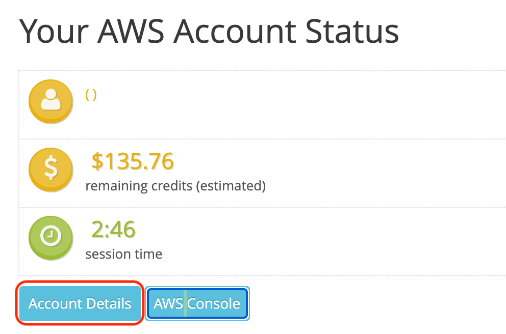
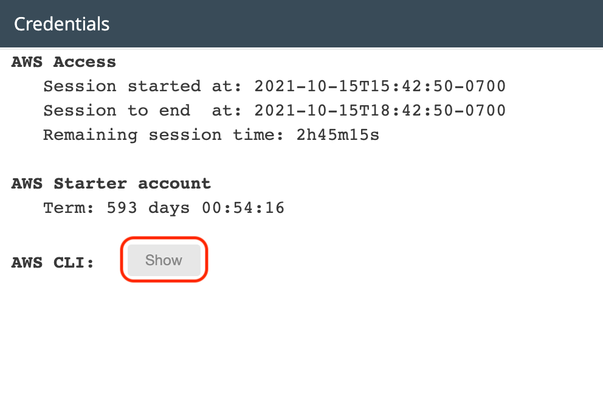
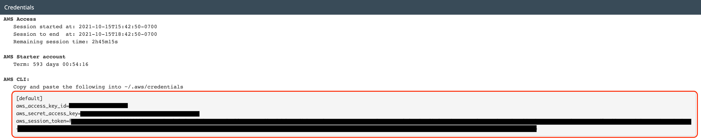

# 2021/10/19 授業内容
* 先週作成した仮想サーバと同じ環境を自動的に構築する。

---
# 構築手順
1. Cloud 9作成
2. terraformインストール
3. 認証情報の設定
4. 

---
# Cloud 9を作成する
デフォルトのVPCにCloud 9を作成する。

---
# terraformインストール
1. tfenvをインストール

```
git clone https://github.com/tfutils/tfenv.git ~/.tfenv
```

2. terraformをインストール
```
tfenv install 0.15.5
```

3. インストールしたバージョンを使用する
```
tfenv use 0.15.5
```

4. バージョンの確認
```
terraform --version
```

---
# 認証情報の設定
1. Your AWS Account Statusから認証情報を取得する




2. 認証情報を保管する
1.で取得した認証情報をCloud 9に保管する
  * 保管先: ~/.aws/credentials

---
# terraformのプロジェクトを用意する
1. `G1/terraform-sample` をCloud 9にコピーする
2. `terraform-sample` の下に移動
3. 環境変数を設定
    ```
    source .envrc
    ```
4. キーペアの情報を書き換える
main.tfの `key_name` の値を自分の環境のキーペアの名前に書き換える
```
resource "aws_instance" "bastion" {
  ami = "ami-02e136e904f3da870"
  instance_type = "t2.micro"
  key_name = "your-key-pair"
  subnet_id =  aws_subnet.your-sub-pub1.id
  vpc_security_group_ids = [
    aws_security_group.bastion.id
  ]
  tags = {
    Name = "bastion"
  }
}
```

---
# 環境構築
1. 初期化
    ```
    terraform init
    ```
2. 接続確認
    ```
    terraform plan
    ```
3. 実行
    ```
    terraform apply
    ```

---
# 環境破棄
```
terraform destroy
```
