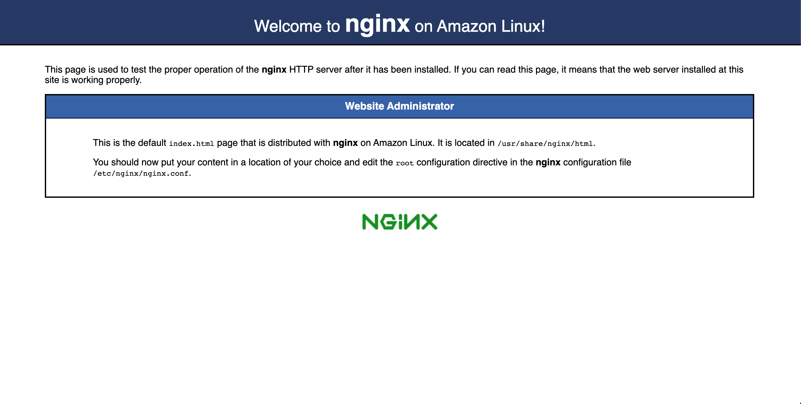

# 2021/11/02 授業内容
Webサーバについて

---
## Webサーバとは？

[Webサーバ](https://ja.wikipedia.org/wiki/Web%E3%82%B5%E3%83%BC%E3%83%90)

---
## 演習
Webサーバを構築する

1. terraformで前々回の環境を構築する
2. terraformの定義にWebサーバ用のEC2インスタンスを追加する
3. terraformでWebサーバ用のEC2インスタンスを追加する
4. 追加したインスタンスにWebサーバ（nginx）をインストールする

---
# terraformで前々回の環境を構築する

---
# terraformの定義にWebサーバ用のEC2インスタンスを追加する
* aws_security_group(1つ)
* aws_security_group_rule(2つ、ssh, http)
* aws_instance(1つ)

---
# terraformでWebサーバ用のEC2インスタンスを追加する
1. 定義に追加したリソースの確認（terraform plan）
2. リソースの追加（terraform apply）

---
# 追加したインスタンスにWebサーバ（nginx）をインストールする

1. nginxをインストールする
```
sudo amazon-linux-extras install nginx1
```

2. nginxを起動する
```
sudo systemctl start nginx
```

`systemctl status`の結果、以下のように表示されればOK

```
[ec2-user@ip-172-31-63-250 ~]$ sudo systemctl status nginx
● nginx.service - The nginx HTTP and reverse proxy server
   Loaded: loaded (/usr/lib/systemd/system/nginx.service; disabled; vendor preset: disabled)
   Active: active (running) since Tue 2020-09-08 09:06:27 UTC; 16s ago
  Process: 1787 ExecStart=/usr/sbin/nginx (code=exited, status=0/SUCCESS)
  Process: 1784 ExecStartPre=/usr/sbin/nginx -t (code=exited, status=0/SUCCESS)
  Process: 1783 ExecStartPre=/usr/bin/rm -f /run/nginx.pid (code=exited, status=0/SUCCESS)
 Main PID: 1790 (nginx)
   CGroup: /system.slice/nginx.service
           ├─1790 nginx: master process /usr/sbin/nginx
           └─1791 nginx: worker process

Sep 08 09:06:27 ip-172-31-63-250.ec2.internal systemd[1]: Starting The nginx HTTP and reverse proxy server...
Sep 08 09:06:27 ip-172-31-63-250.ec2.internal nginx[1784]: nginx: the configuration file /etc/nginx/nginx.conf syntax is ok
Sep 08 09:06:27 ip-172-31-63-250.ec2.internal nginx[1784]: nginx: configuration file /etc/nginx/nginx.conf test is successful
Sep 08 09:06:27 ip-172-31-63-250.ec2.internal systemd[1]: Failed to read PID from file /run/nginx.pid: Invalid argument
Sep 08 09:06:27 ip-172-31-63-250.ec2.internal systemd[1]: Started The nginx HTTP and reverse proxy server.
```

3. nginxの自動起動を有効にする
```
sudo systemctl enable nginx
```

4. 動作確認
ブラウザからEC2インスタンスのパブリックIPでアクセスして以下の画面が表示されればOK


