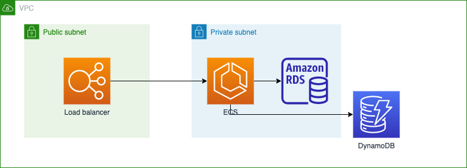

# 2021/12/14 授業内容

---
# 演習
terraformを使ってアプリケーションサーバを構築する

## システム構成


## 事前準備
AWS Consoleで以下のIAMロールを作成する。

1. AWS consoleにログイン
2. IAM -> Rolesに移動
3. 「Create role」を押下
4. Elastic Container Serviceを選択
5. Elastic Container Service Taskを選択
6. 「Next: Permissions」を押下
7. Filter policiesにDynamodbを入力
8. AmazonDynamodbFullAccessを選択
9. 「Next: Tags」を押下
10. 「Next: Review」を押下
11. Role nameを入力
12. 「Create role」を押下

作成したロールを表示して、Role ARNをコピーしておく

IAMロールもterraformで作成できるはずだが、使用している環境ではエラー（権限なし）となってしまうため、手動で作成する。

## 手順

1. 以下のプロジェクトをCloud 9上にcloneする。
https://github.com/cupperservice/terraform-sample

2. staging/main.tfを自身の環境に合わせて修正する

3. terraformを実行して環境を構築する

## 確認方法

cloud 9上で以下を実行し、レスポンスが正常(ステータスコード: 200)に返ってくればOK。

```
HOST=your application load balancer DNS name
curl -XGET http://${HOST}/health/check -v
```

## 課題の提出
* 期限：12/20(月) 17:00
* 提出物
  * 確認方法の実行結果（スクリーンショット）
