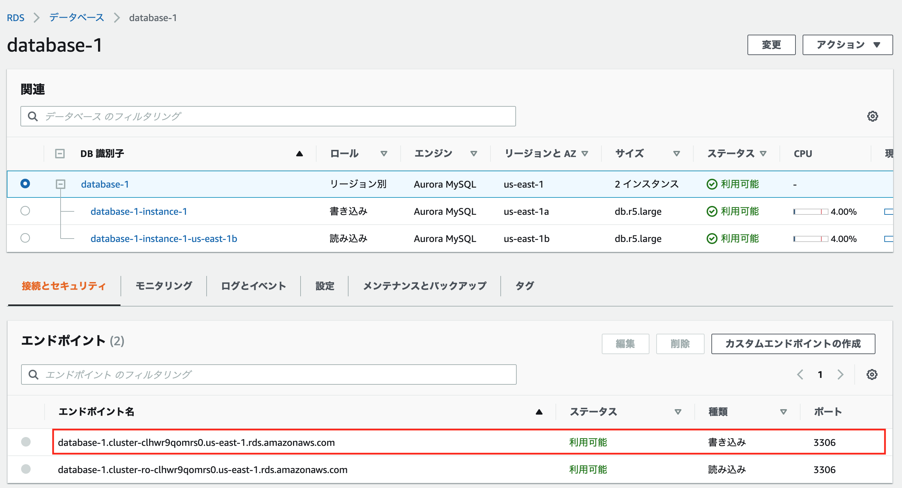

# 演習

## 内容
terraformでデータベースを作成して、SQLを使ってデータベースを操作する。

## 追加するterraformの定義
```
// Security Group for database
resource "aws_security_group" "db" {
  name = "db"
  description = "for database server"
  vpc_id = aws_vpc.main.id

  egress {
    from_port = 0
    to_port = 0
    protocol = "-1"
    cidr_blocks = ["0.0.0.0/0"]
  }
}

resource "aws_security_group_rule" "db" {
  security_group_id = aws_security_group.db.id

  type = "ingress"

  from_port = 3306
  to_port = 3306
  protocol = "tcp"

  source_security_group_id = aws_security_group.bastion.id
}

# RDS
resource "aws_db_subnet_group" "your-db" {
    name        = "your-db"
    subnet_ids  = ["${aws_subnet.your-sub-pri1.id}", "${aws_subnet.your-sub-pri2.id}"]
    tags = {
        Name = "your-db"
    }
}

resource "aws_db_instance" "your-db" {
  identifier           = "your-db"
  allocated_storage    = 20
  storage_type         = "gp2"
  engine               = "mysql"
  engine_version       = "5.7.34"
  instance_class       = "db.t2.small"
  name                 = "sample"
  username             = "your name"
  password             = "your password"
  vpc_security_group_ids  = ["${aws_security_group.db.id}"]
  db_subnet_group_name = "${aws_db_subnet_group.your-db.name}"
  skip_final_snapshot = true
}
```

## Databaseのエンドポイントを取得
以下の画像の赤枠の部分をコピーする。



## SSHポートフォーワーディング（トンネリング）を確立する

```
ssh -i 秘密鍵 -L 3306:Databaseのエンドポイント:3306 ec2-user@bastionサーバのpublic ip
```

## データベースへの接続確認
mysql コマンドを使用してWebサーバからデータベースに接続できることを確認する。

* コマンド
    ```
    mysql -uユーザーID -pパスワード -h 127.0.0.1
    ```

以下のようになれば接続OK
```
[ec2-user@ip-192-168-10-83 ~]$ mysql -uadmin -pxxxxxxxx -hdatabase-1.cluster-clhwr9qomrs0.us-east-1.rds.amazonaws.com
mysql: [Warning] Using a password on the command line interface can be insecure.
Welcome to the MySQL monitor.  Commands end with ; or \g.
Your MySQL connection id is 22
Server version: 5.7.12 MySQL Community Server (GPL)

Copyright (c) 2000, 2020, Oracle and/or its affiliates. All rights reserved.

Oracle is a registered trademark of Oracle Corporation and/or its
affiliates. Other names may be trademarks of their respective
owners.

Type 'help;' or '\h' for help. Type '\c' to clear the current input statement.

mysql> 
```

## データベース作成
mysqlのコンソールから以下のSQLを実行する。

[SQL](./create.sql)

1. CREATE DATABASEの行をコピペして実行する
2. `use sampledb`を実行
3. 残りのSQLを実行

以下のように表示されればOK
```
+------------+-----------+-------------+-------+
| first_name | last_name | class_name  | score |
+------------+-----------+-------------+-------+
| Taro       | Suzuki    | Mathematics |    90 |
| Taro       | Suzuki    | English     |    53 |
| Taro       | Suzuki    | Chemistry   |    76 |
| Hanako     | Mochizuki | Mathematics |    67 |
| Hanako     | Mochizuki | Chemistry   |    43 |
| Yuko       | Tanaka    | Mathematics |    55 |
| Yuko       | Tanaka    | English     |    77 |
| Yuko       | Tanaka    | Chemistry   |    66 |
| Tomoko     | Hayashi   | Mathematics |   100 |
| Tomoko     | Hayashi   | English     |    79 |
| Tomoko     | Hayashi   | Chemistry   |    97 |
| Jiro       | Nakata    | Mathematics |    23 |
| Jiro       | Nakata    | English     |    45 |
| Jiro       | Nakata    | Chemistry   |    77 |
+------------+-----------+-------------+-------+
```

## テーブル操作
1. 生徒の名前(first_name, last_name)と平均点を表示してみましょう。  
平均の計算はAVG関数を使います。

2. 50点以下の点数をとった生徒の名前(first_name, last_name)とクラス名、点数を表示してみましょう。
