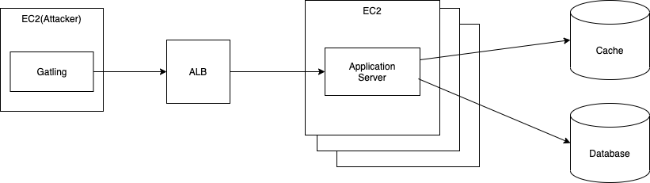

# 2021年度の授業について

2021.04.20
Kazuhisa Kawashima

---

# 2021年度の授業内容
## クラウド構築演習

---

# 目的
## WebシステムをAWS上に構築できる
## Webシステムの性能評価ができる

---

# 昨年度の振り返り

1. クラウドの基礎（座学）
2. S3によるコンテンツ配信
3. Lambda, DynamoDB, S3を使ったサーバーレス
4. Webサーバの構築
5. RDS
6. 3階層システムの構築
7. WordPressの構築

---

# 今年度の内容
1. Webシステムの構築
2. Webシステムの性能試験

---

# 作成するWebシステムの構成

